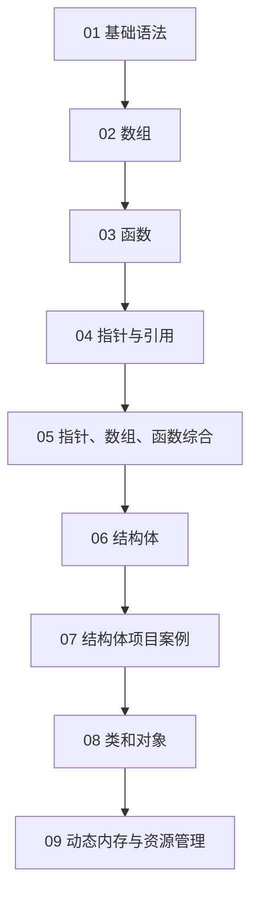

# C++ 学习笔记导航与目录

> 这个文件用于整理整个 `notes/` 目录的学习结构。  
> 目前先不强行移动原文件，先用“导航目录”的方式把所有笔记串起来，避免文件名和章节顺序看起来混乱。

---

## 0. 总体学习路线



建议复习顺序：

1. 先复习程序流程结构，掌握顺序、选择、循环。
2. 再看数组，理解连续存储和下标访问。
3. 再看函数，理解形参、实参、返回值和函数调用。
4. 再重点看指针，因为后面的数组、函数、结构体、类都会用到指针。
5. 然后看结构体和案例，理解“把多个数据组合成一个整体”。
6. 最后看类和对象，理解 C++ 从结构体进一步走向面向对象。

---

## 1. 基础语法模块

这一部分解决“程序怎么写起来”的问题。

| 推荐顺序 | 文件 | 复习重点 |
|---|---|---|
| 1 | [01程序流程结构.md](./01程序流程结构.md) | 顺序结构、选择结构、循环结构 |
| 2 | [02数组.md](./02数组.md) | 一维数组、二维数组、数组下标、数组遍历 |
| 3 | [03函数.md](./03函数.md) | 函数定义、函数调用、形参实参、返回值 |

---

## 2. 指针与内存模块

这一部分是当前笔记里最核心的一组内容，因为后面的结构体、类、动态内存都会用到。

| 推荐顺序 | 文件 | 复习重点 |
|---|---|---|
| 1 | [04指针与函数总结.md](./04指针与函数总结.md) | 指针变量、地址、解引用、指针作函数参数 |
| 2 | [05const修饰指针的几种情形.md](./05const修饰指针的几种情形.md) | `const int*`、`int* const`、常量指针和指针常量 |
| 3 | [06数组函数指针结合运用.md](./06数组函数指针结合运用.md) | 数组、函数、指针的综合运用 |

这一模块建议重点掌握：

```cpp
int a = 10;
int* p = &a;
*p = 20;
```

以及：

```cpp
void swap(int* p1, int* p2);
```

因为这两类写法会直接影响后面理解 `this` 指针、结构体指针、动态内存。

---

## 3. 结构体与小项目模块

这一部分是从“单个变量”过渡到“组合数据”的阶段。

| 推荐顺序 | 文件 | 复习重点 |
|---|---|---|
| 1 | [07结构的学习.md](./07结构的学习.md) | 结构体定义、结构体变量、结构体数组、结构体指针 |
| 2 | [08结构体学习的案例.md](./08结构体学习的案例.md) | 结构体案例分析，理解数据组织方式 |
| 3 | [09通讯录管理系统案例总结.md](./09通讯录管理系统案例总结.md) | 用结构体数组/函数完成小型项目 |

这一模块和类的关系很近：

```cpp
struct Student {
    string name;
    int age;
};
```

后面学 `class` 时，可以把它看成结构体的进一步封装版本。

---

## 4. 类和对象模块

这一部分是从 C 风格程序设计走向 C++ 面向对象的重点。

| 推荐顺序 | 文件 | 复习重点 |
|---|---|---|
| 1 | [05_类和对象_this构造析构友元_new_delete复习笔记.md](./05_类和对象_this构造析构友元_new_delete复习笔记.md) | `class`、对象、`this`、构造函数、析构函数、友元、`new/delete` |

建议复习顺序：

1. 先理解 `class` 和 `struct` 的区别。
2. 再理解对象和成员函数。
3. 再理解 `this` 指针。
4. 再学构造函数、初始化列表、缺省构造函数。
5. 然后学析构函数。
6. 最后把析构函数和 `new/delete` 动态内存联系起来。

---

## 5. 当前目录存在的问题

当前 `notes/` 目录主要问题不是内容少，而是文件名和章节关系有点混在一起：

1. `05_类和对象...` 和 `05const...` 都以 `05` 开头，容易误以为是同一章。
2. 指针相关内容分散在 `04`、`05const`、`06` 中，但没有一个清晰的“指针模块”目录。
3. 结构体相关内容是连续的，但没有和前面的函数/指针、后面的类联系起来。
4. 类和对象这份笔记内容很完整，但文件名太长，阅读列表时不够清楚。

---

## 6. 推荐的最终文件结构

后续可以把 `notes/` 目录整理成下面这样：

```text
notes/
├── 00_笔记导航与目录.md
├── 01_基础语法/
│   ├── 01_程序流程结构.md
│   ├── 02_数组.md
│   └── 03_函数.md
├── 02_指针与内存/
│   ├── 01_指针与函数.md
│   ├── 02_const修饰指针.md
│   ├── 03_数组函数指针综合.md
│   └── 04_new_delete动态内存.md
├── 03_结构体与案例/
│   ├── 01_结构体基础.md
│   ├── 02_结构体案例.md
│   └── 03_通讯录管理系统.md
└── 04_类和对象/
    └── 01_this构造析构友元.md
```

这样整理后，复习逻辑会更清楚：

```text
基础语法 → 数组 → 函数 → 指针 → 结构体 → 类和对象
```

---

## 7. 考前快速复习建议

### 第一轮：按模块复习

按照本导航的四个模块顺序看：

```text
基础语法 → 指针与内存 → 结构体与项目 → 类和对象
```

### 第二轮：只看易错点

重点看：

- 指针地址和解引用；
- 数组名和指针的关系；
- 函数参数传值、传地址、传引用；
- 结构体指针 `p->成员`；
- 类中的 `this->成员`；
- 构造函数和普通函数区别；
- `new/delete` 配对；
- 析构函数什么时候需要自己写。

### 第三轮：用小项目串知识

推荐用“通讯录管理系统”来串：

```text
结构体数组 + 函数封装 + 指针传参 + 菜单循环
```

再用“类和对象”笔记进一步理解：

```text
结构体 → 类
普通函数 → 成员函数
结构体指针 p->成员 → this->成员
手动初始化 → 构造函数
手动清理 → 析构函数
```
