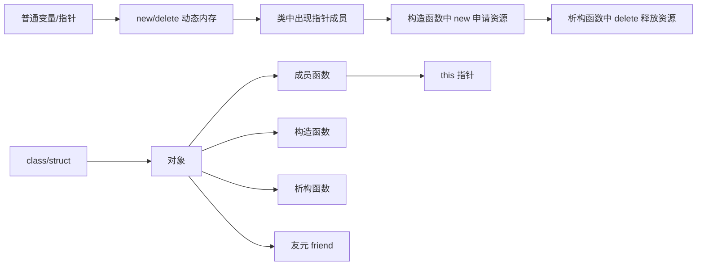

# C++ 复习笔记：类和对象、this 指针、构造/析构、友元、new/delete

> 对应内容：第 5 章《类和对象》为主，第 4 章《指针和引用》中的 `new/delete` 为辅助。  
> 复习目标：不是零散背语法，而是理解 **对象如何创建、如何使用、如何释放资源**。

---

## 目录

- [0. 总体主线](#0-总体主线)
- [1. 内存基础：普通变量、指针、new/delete](#1-内存基础普通变量指针newdelete)
- [2. 类和对象：从结构体到 class](#2-类和对象从结构体到-class)
- [3. this 指针：成员函数怎么知道操作哪个对象](#3-this-指针成员函数怎么知道操作哪个对象)
- [4. 构造函数：对象出生时做初始化](#4-构造函数对象出生时做初始化)
- [5. 初始化列表：成员出生时直接定值](#5-初始化列表成员出生时直接定值)
- [6. 缺省构造函数：不传参数也能创建对象](#6-缺省构造函数不传参数也能创建对象)
- [7. 析构函数：对象销毁时清理资源](#7-析构函数对象销毁时清理资源)
- [8. 友元 friend：有限开放 private 权限](#8-友元-friend有限开放-private-权限)
- [9. 综合例子：把知识串起来](#9-综合例子把知识串起来)
- [10. 高频易错点清单](#10-高频易错点清单)
- [11. 最后背诵版总结](#11-最后背诵版总结)

---

## 0. 总体主线

这一部分知识最好按下面这条线理解：



核心理解：

| 知识点 | 一句话作用 |
|---|---|
| 普通变量 | 系统自动分配和回收内存 |
| 指针 | 保存地址，通过地址间接访问变量 |
| `new/delete` | 程序员手动申请/释放动态内存 |
| 类和对象 | 类是类型，对象是真正的数据实体 |
| `this` 指针 | 让成员函数知道当前操作的是哪个对象 |
| 构造函数 | 对象创建时自动初始化 |
| 初始化列表 | 成员刚出生时直接给初值 |
| 缺省构造函数 | 不传参数也能创建对象 |
| 析构函数 | 对象销毁时自动清理资源 |
| 友元 | 允许类外函数/类访问 private 成员 |

---

## 1. 内存基础：普通变量、指针、new/delete

### 1.1 普通变量不是“没有内存”，而是系统自动管理

平时写：

```cpp
int a = 10;
double x = 3.14;
char c = 'A';
```

这些变量当然都有内存，只是你不用手动申请。

例如：

```cpp
void f() {
    int x = 10;
}
```

函数 `f()` 被调用时，系统自动给 `x` 分配内存；函数结束后，系统自动回收 `x` 的内存。

所以不能写：

```cpp
delete x; // 错误：x 不是 new 出来的
```

### 1.2 形参也有内存

```cpp
void addOne(int x) {
    x = x + 1;
}

int main() {
    int a = 10;
    addOne(a);
}
```

调用 `addOne(a)` 时，形参 `x` 会获得一份 `a` 的值。

此时：

```text
a = 10
x = 10
```

函数中改的是 `x`，不是 `a`。

### 1.3 指针传参：传的是地址

```cpp
void swap(int* p1, int* p2) {
    int t = *p1;
    *p1 = *p2;
    *p2 = t;
}

int main() {
    int a = 2, b = 3;
    swap(&a, &b);
}
```

这里：

- `&a` 是变量 `a` 的地址；
- `p1` 保存 `a` 的地址；
- `*p1` 就是通过地址找到 `a` 本身。

所以函数虽然不能直接访问 `main` 里的局部变量名 `a`、`b`，但可以通过地址间接修改它们。

### 1.4 引用传参：像“自动解引用的指针”

```cpp
void swap(int& x, int& y) {
    int t = x;
    x = y;
    y = t;
}
```

调用：

```cpp
swap(a, b);
```

进入函数后：

```text
x 是 a 的别名
y 是 b 的别名
```

所以引用传参不复制对象，可以直接操作原对象。

### 1.5 为什么需要 new

如果班级人数运行时才知道：

```cpp
int n;
cin >> n;
```

不能在早期标准 C++ 中写：

```cpp
int score[n]; // 早期 C++ 不允许这样定义运行时长度数组
```

可以写：

```cpp
int* score = new int[n];
```

意思是：

> 程序运行时，申请一块能放 `n` 个 `int` 的连续空间，并把首地址交给 `score`。

用完后：

```cpp
delete[] score;
```

### 1.6 new/delete 配对表

| 申请方式 | 释放方式 | 说明 |
|---|---|---|
| `int* p = new int;` | `delete p;` | 申请单个变量 |
| `int* p = new int(5);` | `delete p;` | 申请单个变量，并初始化为 5 |
| `int* a = new int[n];` | `delete[] a;` | 申请一维数组 |
| `Student* s = new Student;` | `delete s;` | 申请单个对象 |
| `Student* arr = new Student[n];` | `delete[] arr;` | 申请对象数组 |

最重要：

```cpp
new      -> delete
new[]    -> delete[]
```

### 1.7 new/delete 四个易错点

#### 易错点 1：申请后未初始化

```cpp
int* p = new int;
cout << *p << endl; // 可能是随机值
```

更安全：

```cpp
int* p = new int(0);
```

#### 易错点 2：把 new 得到的地址弄丢

```cpp
int* p = new int(10);
int x = 20;
p = &x;       // 原来的动态内存地址丢了
```

这样原来 `new int(10)` 的空间无法释放，形成内存泄漏。

#### 易错点 3：delete 后继续使用

```cpp
int* p = new int(10);
delete p;
cout << *p << endl; // 错误：释放后的空间不能再用
```

推荐：

```cpp
delete p;
p = nullptr;
```

#### 易错点 4：对普通变量地址 delete

```cpp
int x = 10;
int* p = &x;
delete p; // 错误：x 不是 new 出来的
```

规则：**只有 new 出来的空间，才能 delete。**

---

## 2. 类和对象：从结构体到 class

### 2.1 类只是类型，对象才是真正的数据

```cpp
class Circle {
    int radius;
};
```

这只是定义了一种新类型 `Circle`，还没有真正创建圆对象。

创建对象：

```cpp
Circle c1;
Circle c2;
```

这时 `c1` 和 `c2` 才各自拥有自己的 `radius`。

### 2.2 class 和 struct 的区别

C++ 中 `class` 和 `struct` 都可以有数据成员、成员函数。

主要区别：默认访问权限不同。

```cpp
class A {
    int x; // 默认 private
};

struct B {
    int x; // 默认 public
};
```

所以：

```cpp
A a;
a.x = 10; // 错误

B b;
b.x = 10; // 正确
```

### 2.3 public/private 的学习重点

| 权限 | 谁能访问 |
|---|---|
| `private` | 只有本类成员函数、友元可以访问 |
| `public` | 类外也可以访问 |
| `protected` | 本类和派生类可以访问，后面继承会用到 |

一般写类时，数据成员通常设为 `private`，通过 `public` 成员函数间接访问。

---

## 3. this 指针：成员函数怎么知道操作哪个对象

### 3.1 问题来源

```cpp
class Circle {
    int radius;
public:
    void setRadius(int r) {
        radius = r;
    }
};

Circle c1, c2;
c1.setRadius(3);
c2.setRadius(5);
```

`setRadius` 的代码只有一份，但它怎么知道这次要修改 `c1.radius` 还是 `c2.radius`？

答案：成员函数被调用时，系统会自动传入一个隐藏指针 `this`。

### 3.2 this 的含义

```cpp
void setRadius(int r) {
    this->radius = r;
}
```

`this` 表示：

> 当前正在调用该成员函数的对象的地址。

所以：

```cpp
c1.setRadius(3);
```

可以理解为 `this` 指向 `c1`。

```cpp
c2.setRadius(5);
```

可以理解为 `this` 指向 `c2`。

### 3.3 this 和结构体指针的相似之处

结构体指针：

```cpp
Student* p = &s;
p->age = 18;
```

等价于：

```cpp
(*p).age = 18;
```

类中的 `this`：

```cpp
this->radius = r;
```

等价于：

```cpp
(*this).radius = r;
```

区别：

- `p` 是你自己定义的指针；
- `this` 是系统自动传入的隐藏指针。

### 3.4 什么时候必须写 this

当形参名和成员变量名相同时：

```cpp
class Circle {
    int radius;
public:
    void setRadius(int radius) {
        this->radius = radius;
    }
};
```

左边 `this->radius` 是成员变量，右边 `radius` 是形参。

如果写成：

```cpp
radius = radius;
```

就变成形参自己赋给自己，没有修改对象成员。

---

## 4. 构造函数：对象出生时做初始化

### 4.1 构造函数的作用

构造函数负责对象刚创建时的初始化。

```cpp
class Circle {
    int radius;
public:
    Circle(int r) {
        radius = r;
    }
};

Circle c(5); // 创建对象时自动调用 Circle(int r)
```

### 4.2 构造函数和普通 public 函数的区别

| 对比点 | 构造函数 | 普通成员函数 |
|---|---|---|
| 名字 | 必须和类名相同 | 自己命名 |
| 返回值 | 没有返回值，不能写 `void` | 可以有返回值 |
| 调用时机 | 创建对象时自动调用 | 对象创建后手动调用 |
| 主要作用 | 初始化对象 | 操作对象 |
| 能否重载 | 可以 | 可以 |

错误写法：

```cpp
void Circle(int r) { // 错误：构造函数不能写 void
    radius = r;
}
```

### 4.3 构造函数 vs set 函数

```cpp
class Circle {
    int radius;
public:
    Circle(int r) {
        radius = r;
    }

    void setRadius(int r) {
        radius = r;
    }
};
```

区别：

```cpp
Circle c(5);      // 初始化：对象出生时设置半径
c.setRadius(10);  // 修改：对象出生后重新设置半径
```

构造函数管“出生时”，普通成员函数管“出生后”。

---

## 5. 初始化列表：成员出生时直接定值

### 5.1 两种写法

写法一：函数体赋值。

```cpp
class Point {
    int x, y;
public:
    Point(int a, int b) {
        x = a;
        y = b;
    }
};
```

写法二：初始化列表。

```cpp
class Point {
    int x, y;
public:
    Point(int a, int b) : x(a), y(b) {
    }
};
```

### 5.2 本质区别

| 写法 | 本质 |
|---|---|
| 函数体赋值 | 成员先创建，再赋值 |
| 初始化列表 | 成员创建时直接得到初值 |

对于普通 `int` 成员，两者很多时候效果类似；但初始化列表更标准。

### 5.3 必须用初始化列表的情况

#### const 成员

```cpp
class Student {
    const int id;
public:
    Student(int x) : id(x) {
    }
};
```

不能写：

```cpp
Student(int x) {
    id = x; // 错误：const 成员不能出生后再赋值
}
```

#### 引用成员

```cpp
class Test {
    int& ref;
public:
    Test(int& x) : ref(x) {
    }
};
```

引用必须一开始就绑定到某个变量。

#### 对象成员

```cpp
class Date {
    int year, month, day;
public:
    Date(int y, int m, int d) : year(y), month(m), day(d) {}
};

class Person {
    Date birthday;
public:
    Person(int y, int m, int d) : birthday(y, m, d) {
    }
};
```

`birthday(y, m, d)` 表示调用 `Date` 的构造函数初始化对象成员。

### 5.4 初始化顺序

初始化顺序由成员声明顺序决定，不由初始化列表书写顺序决定。

```cpp
class Point {
    int x;
    int y;
public:
    Point(int a, int b) : y(b), x(a) {
    }
};
```

虽然列表里先写 `y(b)`，但实际先初始化 `x`，再初始化 `y`。

建议按声明顺序写：

```cpp
Point(int a, int b) : x(a), y(b) {}
```

---

## 6. 缺省构造函数：不传参数也能创建对象

### 6.1 定义

缺省构造函数就是：

> 不传参数也能调用的构造函数。

```cpp
class Circle {
    int radius;
public:
    Circle() {
        radius = 0;
    }
};

Circle c; // 调用 Circle()
```

注意：

```cpp
Circle c(); // 容易被解释为函数声明，不是创建对象
```

### 6.2 编译器自动提供的缺省构造函数

如果你一个构造函数都不写：

```cpp
class Rectangle {
    float length, width;
};

Rectangle r; // 可以
```

编译器会自动提供一个类似：

```cpp
Rectangle() {}
```

但它通常不会把普通成员初始化成你想要的值。

### 6.3 自己写了构造函数后，系统不再自动提供无参构造函数

```cpp
class Circle {
    int radius;
public:
    Circle(int r) {
        radius = r;
    }
};

Circle c1(5); // 正确
Circle c2;    // 错误：没有 Circle()
```

解决方法一：补无参构造函数。

```cpp
Circle() { radius = 0; }
Circle(int r) { radius = r; }
```

解决方法二：使用默认参数。

```cpp
Circle(int r = 0) { radius = r; }
```

### 6.4 防止二义性

错误写法：

```cpp
class Circle {
    int radius;
public:
    Circle() {}
    Circle(int r = 0) { radius = r; }
};

Circle c; // 错误：两个构造函数都能不传参调用
```

`Circle()` 和 `Circle(int r = 0)` 都能匹配 `Circle c;`，编译器不知道选哪个。

---

## 7. 析构函数：对象销毁时清理资源

### 7.1 析构函数的作用

析构函数负责对象销毁时的清理工作。

```cpp
class Point {
public:
    Point() {
        cout << "Constructor called" << endl;
    }

    ~Point() {
        cout << "Destructor called" << endl;
    }
};
```

构造函数负责“出生”，析构函数负责“死亡前清理”。

### 7.2 语法规则

| 规则 | 说明 |
|---|---|
| 名字 | `~类名()` |
| 返回值 | 没有返回值，不能写 `void` |
| 参数 | 不能有参数 |
| 重载 | 不能重载 |
| 调用方式 | 对象销毁时自动调用 |

### 7.3 对象销毁顺序

同一作用域内，后创建的对象先销毁。

```cpp
Point p1;
Point p2;
Point p3;
```

销毁顺序：

```text
p3 -> p2 -> p1
```

### 7.4 什么时候必须自己写析构函数

如果类中只有普通成员：

```cpp
class Point {
    int x, y;
};
```

一般不用自己写析构函数。

如果类中有指针成员，并且类自己用 `new` 申请了内存，就通常要自己写析构函数。

```cpp
class Person {
    char* name;
public:
    Person(const char* n) {
        name = new char[strlen(n) + 1];
        strcpy(name, n);
    }

    ~Person() {
        delete[] name;
    }
};
```

构造函数：申请资源。

```cpp
name = new char[strlen(n) + 1];
```

析构函数：释放资源。

```cpp
delete[] name;
```

核心原则：

> 谁申请，谁释放；构造申请，析构释放。

---

## 8. 友元 friend：有限开放 private 权限

### 8.1 为什么需要友元

类的 `private` 成员默认不能被类外函数访问：

```cpp
class Point {
private:
    int x, y;
};
```

类外不能写：

```cpp
Point p;
p.x = 10; // 错误
```

如果某个类外函数确实需要直接访问类内部数据，可以把它声明为友元。

### 8.2 友元函数

```cpp
#include <iostream>
#include <cmath>
using namespace std;

class Point {
private:
    int x, y;
public:
    Point(int a = 0, int b = 0) : x(a), y(b) {}

    friend double distance(const Point& p1, const Point& p2);
};

double distance(const Point& p1, const Point& p2) {
    int dx = p1.x - p2.x;
    int dy = p1.y - p2.y;
    return sqrt(dx * dx + dy * dy);
}
```

`friend` 声明表示：`Point` 允许 `distance` 函数访问自己的私有成员。

### 8.3 友元函数不是成员函数

虽然声明写在类里面，但友元函数不是成员函数。

所以调用方式是：

```cpp
distance(a, b);
```

不是：

```cpp
a.distance(b); // 错误
```

友元函数没有 `this` 指针，所以必须通过参数拿到对象。

### 8.4 引用传参在友元函数中的作用

```cpp
double distance(const Point& p1, const Point& p2)
```

这里的 `const Point&` 表示：

- 不复制对象；
- 函数里不能修改对象；
- `p1`、`p2` 是实参对象的别名。

如果写成：

```cpp
double distance(Point p1, Point p2)
```

会复制对象，效率较低。

### 8.5 友元类

```cpp
class Date {
private:
    int year, month, day;
public:
    friend class Person;
};
```

意思是：

> `Date` 允许 `Person` 类访问自己的私有成员。

方向不要搞反：`friend class Person;` 写在 `Date` 里面，所以是 `Date` 给 `Person` 权限。

### 8.6 友元关系的三个“不”

| 特性 | 含义 |
|---|---|
| 没有交换性 | A 把 B 当友元，不代表 B 也把 A 当友元 |
| 没有传递性 | A 是 B 的友元，B 是 C 的友元，不代表 A 是 C 的友元 |
| 没有继承性 | 友元权限不会自然传给子类 |

### 8.7 使用原则

友元可以提高访问效率和书写便利，但它绕开了封装。

所以原则是：

> 能用 public 接口解决就优先用 public 接口；只有关系紧密、确实需要直接访问内部数据时才用友元。

---

## 9. 综合例子：把知识串起来

```cpp
#include <iostream>
#include <cstring>
using namespace std;

class Person {
private:
    char* name;
    int age;

public:
    // 构造函数 + 默认参数 + 初始化列表
    Person(const char* n = "unknown", int a = 0) : age(a) {
        name = new char[strlen(n) + 1];
        strcpy(name, n);
    }

    // 析构函数：释放构造函数中申请的动态内存
    ~Person() {
        delete[] name;
    }

    // this 用来区分成员变量和形参
    void setAge(int age) {
        this->age = age;
    }

    void show() const {
        cout << name << ", " << age << endl;
    }
};

int main() {
    Person p1("Tom", 18);
    Person p2;

    p1.show();
    p2.show();

    p2.setAge(20);
    p2.show();

    return 0;
}
```

这个例子包含：

| 代码 | 涉及知识点 |
|---|---|
| `Person(...)` | 构造函数 |
| `const char* n = "unknown"` | 默认参数，支持缺省构造 |
| `: age(a)` | 初始化列表 |
| `new char[...]` | 动态内存申请 |
| `~Person()` | 析构函数 |
| `delete[] name` | 动态数组释放 |
| `this->age = age` | `this` 指针 |
| `show() const` | 常成员函数，表示不修改对象 |

---

## 10. 高频易错点清单

### 10.1 构造函数写了返回值

```cpp
void Circle(int r) {} // 错误
```

构造函数没有返回值，连 `void` 也不能写。

### 10.2 写了带参构造后，还想无参创建对象

```cpp
class A {
public:
    A(int x) {}
};

A a; // 错误
```

解决：

```cpp
A() {}
```

或：

```cpp
A(int x = 0) {}
```

### 10.3 同时出现两个缺省构造函数

```cpp
class A {
public:
    A() {}
    A(int x = 0) {}
};

A a; // 错误：二义性
```

### 10.4 const 成员在函数体里赋值

```cpp
class A {
    const int x;
public:
    A(int a) {
        x = a; // 错误
    }
};
```

正确：

```cpp
A(int a) : x(a) {}
```

### 10.5 this 使用错误

```cpp
void setAge(int age) {
    age = age; // 错误倾向：只是形参自己赋给自己
}
```

正确：

```cpp
void setAge(int age) {
    this->age = age;
}
```

### 10.6 new/delete 不配对

```cpp
int* a = new int[10];
delete a; // 错误
```

正确：

```cpp
delete[] a;
```

### 10.7 对普通变量地址 delete

```cpp
int x = 10;
int* p = &x;
delete p; // 错误
```

### 10.8 friend 方向搞反

```cpp
class A {
    friend class B;
};
```

意思是：`B` 可以访问 `A` 的私有成员，不是 `A` 可以访问 `B` 的私有成员。

---

## 11. 最后背诵版总结

1. 普通变量、形参都有内存，只是系统自动分配和回收。
2. `new` 用于运行时手动申请动态内存，`delete` 用于归还动态内存。
3. `new` 对 `delete`，`new[]` 对 `delete[]`。
4. 类是自定义类型，对象才是真正占内存的实体。
5. `class` 默认 `private`，`struct` 默认 `public`。
6. `this` 是当前对象的指针，`this->成员` 表示当前对象的成员。
7. 构造函数在对象创建时自动调用，负责初始化；不能写返回值。
8. 初始化列表是在成员创建时直接给初值，`const` 成员、引用成员、对象成员常常必须用它。
9. 缺省构造函数是不传参数也能调用的构造函数。
10. 只要自己写了任意构造函数，编译器就不再自动提供无参构造函数。
11. 析构函数在对象销毁时自动调用，不能带参数，不能重载。
12. 类里 `new` 了资源，通常要在析构函数里 `delete`。
13. 友元不是成员函数，但可以访问授权类的 `private/protected` 成员。
14. 友元关系没有交换性、没有传递性、没有继承性。
15. 友元会破坏封装，所以要谨慎使用。
