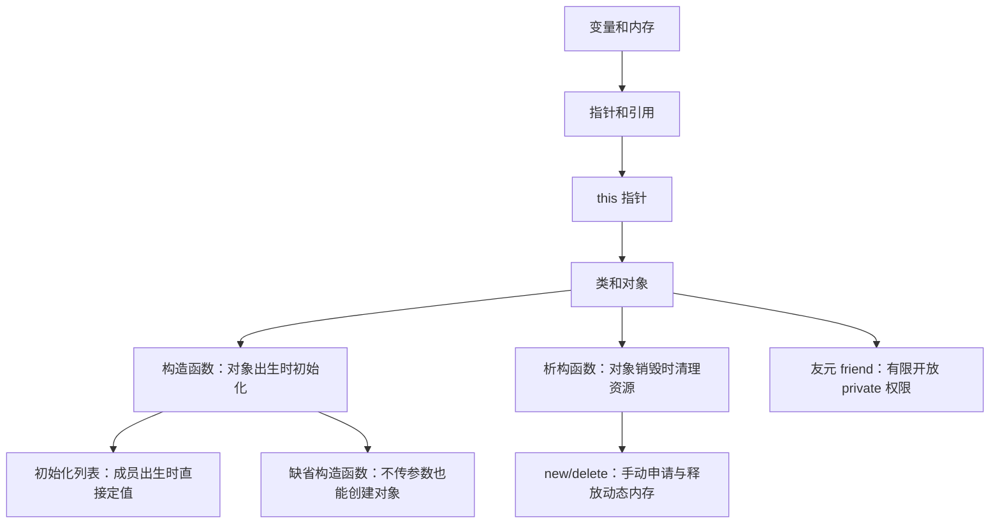

# 第 5 章类和对象 + 第 4 章动态内存复习笔记

> 适用范围：`this` 指针、构造函数、初始化列表、缺省构造函数、析构函数、友元、`new/delete`。  
> 这份笔记按“为什么需要 → 语法怎么写 → 易错点 → 和前后知识的关系”整理，方便后面复习时从整体上串起来。

---

## 0. 一张图先串起来



这一章的核心逻辑是：

1. **类是自定义类型，对象是真正占内存的变量。**
2. **成员函数只有一份代码，但可以服务不同对象，靠隐藏的 `this` 指针区分当前对象。**
3. **构造函数负责对象创建时初始化，析构函数负责对象销毁时清理。**
4. **如果类里自己 `new` 了动态资源，通常就要在析构函数里 `delete`。**
5. **友元是为了让类外函数或其他类访问 private 成员，但会破坏封装，不能滥用。**

---

## 1. 普通变量、指针变量和动态内存的关系

### 1.1 普通变量也有内存，只是系统自动管理

以前写：

```cpp
int a = 10;
double x = 3.14;
char c = 'A';
```

这些变量当然都占内存。只是这类变量通常由系统自动分配、自动回收。例如：

```cpp
void f() {
    int x = 10;
}
```

函数 `f()` 被调用时，系统给局部变量 `x` 分配内存；函数结束后，系统自动回收 `x` 的内存。你不需要也不能写：

```cpp
delete x; // 错误
```

### 1.2 形参也会自动分配内存

```cpp
void addOne(int x) {
    x = x + 1;
}

int main() {
    int a = 10;
    addOne(a);
}
```

调用 `addOne(a)` 时，系统会给形参 `x` 分配空间，并把 `a` 的值复制进去。所以 `x` 是一份副本，修改 `x` 不会影响 `a`。

如果形参是指针：

```cpp
void swap(int* p1, int* p2) {
    int t = *p1;
    *p1 = *p2;
    *p2 = t;
}
```

`p1`、`p2` 本身也有自动分配的内存，它们里面保存的是地址。调用时：

```cpp
swap(&a, &b);
```

传进去的是 `a` 和 `b` 的地址，所以函数可以通过 `*p1`、`*p2` 间接修改外面的变量。

---

## 2. 为什么需要 `new` 和 `delete`

### 2.1 `new` 解决的是“运行时才知道要多少空间”的问题

比如保存一个班学生成绩，如果提前写：

```cpp
int score[100];
```

问题是：

- 实际只有 30 人：浪费 70 个位置；
- 实际有 150 人：数组不够。

更合理的是运行时输入人数：

```cpp
int n;
cin >> n;
int* score = new int[n];
```

这句话的意思是：

> 程序运行时，根据 `n` 的大小申请一块能存放 `n` 个 `int` 的连续空间，并把首地址交给指针 `score`。

用完后必须释放：

```cpp
delete[] score;
```

### 2.2 普通变量和动态变量的区别

```cpp
int x = 10;
```

这是自动内存：系统分配，系统回收。

```cpp
int* p = new int(10);
```

这里有两个东西：

- `p`：一个指针变量，本身通常是局部变量，系统自动管理；
- `new int(10)`：动态申请出来的一块内存，需要程序员手动释放。

完整写法：

```cpp
int* p = new int(10);
cout << *p << endl;
delete p;
p = nullptr;
```

### 2.3 `new/delete` 的基本配对

| 申请方式 | 释放方式 | 说明 |
|---|---|---|
| `int* p = new int;` | `delete p;` | 申请单个变量 |
| `int* p = new int(5);` | `delete p;` | 申请单个变量并初始化为 5 |
| `int* a = new int[n];` | `delete[] a;` | 申请一维数组 |
| `Student* s = new Student;` | `delete s;` | 申请单个对象 |
| `Student* arr = new Student[n];` | `delete[] arr;` | 申请对象数组 |

最重要的规则：

```cpp
new      -> delete
new[]    -> delete[]
```

---

## 3. `new/delete` 使用时的注意事项

### 3.1 申请后要初始化

错误倾向：

```cpp
int* p = new int;
cout << *p << endl; // 可能是随机值
```

更安全：

```cpp
int* p = new int(0);
```

数组也一样：

```cpp
int* a = new int[10];
for (int i = 0; i < 10; i++) {
    a[i] = 0;
}
```

### 3.2 不要把 `new` 得到的地址弄丢

危险写法：

```cpp
int* p = new int(10);
int x = 20;
p = &x;       // 原来 new 出来的地址丢了

delete p;     // 更危险：p 现在指向的不是 new 出来的空间
```

一旦 `p` 被改成别的地址，原来那块动态内存就没办法释放了，形成内存泄漏。

### 3.3 `delete` 后不要继续使用

```cpp
int* p = new int(10);
delete p;
cout << *p << endl; // 错误：释放后的内存不能再访问
```

建议释放后立刻置空：

```cpp
delete p;
p = nullptr;
```

### 3.4 不要重复释放

```cpp
int* p = new int(10);
delete p;
delete p; // 错误：重复 delete
```

如果释放后写成 `p = nullptr;`，那么再次 `delete p;` 是安全的，因为 `delete nullptr;` 不会出错。

### 3.5 不要对普通变量地址使用 `delete`

```cpp
int x = 10;
int* p = &x;
delete p; // 错误：x 不是 new 出来的
```

规则：**只有 `new` 出来的空间才能 `delete`。**

---

## 4. 类和对象的基本关系

### 4.1 类只是类型，对象才真正占内存

```cpp
class Circle {
    int radius;
};
```

这只是定义了一种新类型 `Circle`，并没有真正创建圆对象。

真正创建对象：

```cpp
Circle c1;
Circle c2;
```

这时 `c1` 和 `c2` 各自拥有自己的 `radius`。

### 4.2 `class` 和 `struct` 的相似与区别

C++ 中，`class` 和 `struct` 都可以有数据成员和成员函数。

主要区别是默认访问权限：

```cpp
class A {
    int x; // 默认 private
};

struct B {
    int x; // 默认 public
};
```

所以：

```cpp
A a;
a.x = 10; // 错误

B b;
b.x = 10; // 正确
```

---

## 5. `this` 指针

### 5.1 为什么需要 `this`

成员函数代码在内存中通常只有一份，但对象可以有很多个：

```cpp
Circle c1;
Circle c2;
```

当调用：

```cpp
c1.setRadius(3);
c2.setRadius(5);
```

同一个 `setRadius` 函数必须知道这次操作的是 `c1.radius` 还是 `c2.radius`。这靠的就是系统自动传入的隐藏指针：`this`。

### 5.2 `this` 是当前对象的地址

```cpp
class Circle {
    int radius;
public:
    void setRadius(int r) {
        this->radius = r;
    }
};
```

当执行：

```cpp
c1.setRadius(3);
```

可以理解为 `this` 指向 `c1`。

当执行：

```cpp
c2.setRadius(5);
```

可以理解为 `this` 指向 `c2`。

所以：

```cpp
this->radius = r;
```

意思是：

> 把当前对象的 `radius` 设置为 `r`。

### 5.3 `this->成员` 和结构体指针很像

以前结构体指针写：

```cpp
Student* p = &s;
p->age = 18;
```

`p->age` 等价于：

```cpp
(*p).age
```

类中：

```cpp
this->radius
```

等价于：

```cpp
(*this).radius
```

区别是：

- `p` 是你自己定义的指针；
- `this` 是系统自动提供的当前对象指针。

### 5.4 什么时候必须显式写 `this`

当形参名和成员名相同时：

```cpp
class Circle {
    int radius;
public:
    void setRadius(int radius) {
        this->radius = radius;
    }
};
```

左边 `this->radius` 是成员变量，右边 `radius` 是形参。

如果写成：

```cpp
radius = radius;
```

其实是形参自己赋给自己，没有真正修改对象成员。

---

## 6. 构造函数

### 6.1 构造函数的作用

构造函数负责：

> 对象刚创建时，自动执行初始化。

普通成员函数负责对象创建之后的操作。

```cpp
class Circle {
    int radius;
public:
    Circle(int r) {
        radius = r;
    }

    void setRadius(int r) {
        radius = r;
    }
};
```

使用：

```cpp
Circle c(5);      // 创建对象时自动调用构造函数
c.setRadius(10);  // 对象创建后手动调用普通成员函数
```

### 6.2 构造函数和普通 public 函数的区别

| 对比点 | 构造函数 | 普通成员函数 |
|---|---|---|
| 名字 | 必须和类名相同 | 自己命名 |
| 返回值 | 没有返回值，不能写 `void` | 可以有返回值 |
| 调用时机 | 创建对象时自动调用 | 创建对象后手动调用 |
| 主要作用 | 初始化对象 | 操作对象 |
| 能否重载 | 可以 | 可以 |

错误写法：

```cpp
void Circle(int r) { // 错误：构造函数不能写 void
    radius = r;
}
```

---

## 7. 初始化列表

### 7.1 什么是初始化

初始化就是：

> 对象刚被创建出来时，给它的数据成员安排初始值。

例如：

```cpp
Circle c(5);
```

就是创建 `c` 时把半径初始化为 5。

### 7.2 两种初始化方式

方式一：在构造函数体内赋值。

```cpp
class Point {
    int x, y;
public:
    Point(int a, int b) {
        x = a;
        y = b;
    }
};
```

方式二：成员初始化列表。

```cpp
class Point {
    int x, y;
public:
    Point(int a, int b) : x(a), y(b) {
    }
};
```

### 7.3 二者的本质区别

函数体赋值：

> 成员先被创建，然后再在函数体里赋值。

初始化列表：

> 成员创建的那一刻就直接获得初值。

所以初始化列表更接近真正意义上的“初始化”。

### 7.4 哪些情况必须或强烈建议用初始化列表

1. `const` 数据成员；
2. 引用成员；
3. 对象成员；
4. 基类成员。

例如 `const` 成员：

```cpp
class Student {
    const int id;
public:
    Student(int x) : id(x) {
    }
};
```

不能写：

```cpp
Student(int x) {
    id = x; // 错误：const 成员不能出生后再赋值
}
```

### 7.5 初始化顺序

成员初始化的真实顺序由成员在类中的声明顺序决定，不由初始化列表中的书写顺序决定。

```cpp
class Point {
    int x;
    int y;
public:
    Point(int a, int b) : y(b), x(a) {
    }
};
```

虽然列表中先写 `y(b)`，但实际还是先初始化 `x`，再初始化 `y`。

建议：初始化列表顺序和成员声明顺序保持一致。

---

## 8. 缺省构造函数

### 8.1 什么是缺省构造函数

缺省构造函数就是：

> 不传参数也能调用的构造函数。

例如：

```cpp
class Circle {
    int radius;
public:
    Circle() {
        radius = 0;
    }
};
```

使用：

```cpp
Circle c;
```

注意不要写成：

```cpp
Circle c(); // 容易被解释成函数声明，不是创建对象
```

### 8.2 如果一个构造函数都不写，编译器会自动提供一个

```cpp
class Rectangle {
    float length, width;
};

Rectangle r; // 可以
```

因为编译器会自动提供一个类似这样的构造函数：

```cpp
Rectangle() {}
```

但是它通常不负责把普通成员初始化成你想要的值。

### 8.3 只要自己写了任意构造函数，系统就不再自动给无参构造函数

```cpp
class Circle {
    int radius;
public:
    Circle(int r) {
        radius = r;
    }
};

Circle c1(5); // 正确
Circle c2;    // 错误：没有 Circle()
```

修改方法一：自己补一个无参构造函数。

```cpp
class Circle {
    int radius;
public:
    Circle() { radius = 0; }
    Circle(int r) { radius = r; }
};
```

修改方法二：给参数默认值。

```cpp
class Circle {
    int radius;
public:
    Circle(int r = 0) {
        radius = r;
    }
};
```

这样：

```cpp
Circle c1;
Circle c2(5);
```

都可以。

### 8.4 防止二义性

错误写法：

```cpp
class Circle {
    int radius;
public:
    Circle() {}
    Circle(int r = 0) { radius = r; }
};

Circle c; // 错误：两个构造函数都能不传参调用
```

`Circle()` 和 `Circle(int r = 0)` 都能匹配 `Circle c;`，编译器不知道调用哪个，所以产生二义性。

---

## 9. 析构函数

### 9.1 析构函数的作用

析构函数负责：

> 对象被销毁时自动调用，用来清理资源。

例如：

```cpp
class Point {
public:
    Point() {
        cout << "Constructor called" << endl;
    }

    ~Point() {
        cout << "Destructor called" << endl;
    }
};
```

构造函数负责“出生”，析构函数负责“死亡前清理”。

### 9.2 析构函数的语法规则

| 规则 | 说明 |
|---|---|
| 名字 | `~类名()` |
| 返回值 | 没有返回值，不能写 `void` |
| 参数 | 不能有参数 |
| 重载 | 不能重载 |
| 调用 | 对象销毁时自动调用 |

### 9.3 对象销毁顺序

同一作用域内，后创建的对象先销毁。

```cpp
Point p1;
Point p2;
Point p3;
```

销毁顺序：

```cpp
p3 -> p2 -> p1
```

像一摞盘子，后放上去的先拿走。

### 9.4 什么时候必须自己写析构函数

如果类中只包含普通成员：

```cpp
class Point {
    int x, y;
};
```

一般不需要自己写析构函数。

如果类中包含指向动态内存的指针成员，并且类自己申请了内存，就通常必须写析构函数。

```cpp
class Person {
    char* name;
public:
    Person(const char* n) {
        name = new char[strlen(n) + 1];
        strcpy(name, n);
    }

    ~Person() {
        delete[] name;
    }
};
```

构造函数里：

```cpp
name = new char[strlen(n) + 1];
```

析构函数里：

```cpp
delete[] name;
```

核心原则：**谁申请，谁释放；构造申请，析构释放。**

---

## 10. 友元 friend

### 10.1 为什么需要友元

类的 `private` 成员默认不能被类外函数访问：

```cpp
class Point {
private:
    int x, y;
};
```

类外不能写：

```cpp
Point p;
p.x = 10; // 错误
```

但有时一个类外函数确实需要高效访问类内部数据，比如计算两个点的距离。这时可以把该函数声明为友元函数。

### 10.2 友元函数

```cpp
#include <iostream>
#include <cmath>
using namespace std;

class Point {
private:
    int x, y;
public:
    Point(int a = 0, int b = 0) : x(a), y(b) {}

    friend double distance(Point& p1, Point& p2);
};

double distance(Point& p1, Point& p2) {
    int dx = p1.x - p2.x;
    int dy = p1.y - p2.y;
    return sqrt(dx * dx + dy * dy);
}

int main() {
    Point a(8, 15), b(3, 7);
    cout << distance(a, b) << endl;
    return 0;
}
```

这句：

```cpp
friend double distance(Point& p1, Point& p2);
```

表示 `Point` 类允许 `distance` 函数直接访问自己的私有成员。

### 10.3 友元函数不是成员函数

虽然友元声明写在类里面，但友元函数不是类的成员函数。

所以调用方式是：

```cpp
distance(a, b);
```

不是：

```cpp
a.distance(b); // 错误
```

友元函数没有 `this` 指针，所以它必须通过参数拿到对象。

### 10.4 `Point&` 传的是什么

```cpp
double distance(Point& p1, Point& p2)
```

这里是引用传参，不是普通传值。

调用：

```cpp
distance(a, b);
```

函数内部：

- `p1` 是 `a` 的别名；
- `p2` 是 `b` 的别名。

所以 `p1.x` 实际访问的是 `a.x`。

引用传参的好处：

1. 不复制对象，效率更高；
2. 可以直接访问原对象；
3. 友元函数没有 `this`，必须通过参数拿对象。

如果函数不需要修改对象，更规范的写法是：

```cpp
double distance(const Point& p1, const Point& p2);
```

### 10.5 友元类

```cpp
class Date {
private:
    int year, month, day;
public:
    friend class Person;
};
```

这句话的意思是：

> `Date` 允许 `Person` 类访问自己的私有成员。

注意方向：

```cpp
friend class Person;
```

写在 `Date` 里面，所以是 `Date` 给 `Person` 权限，不是 `Person` 给 `Date` 权限。

### 10.6 友元关系的三个“不”

| 特性 | 含义 |
|---|---|
| 没有交换性 | A 把 B 当友元，不代表 B 也把 A 当友元 |
| 没有传递性 | A 是 B 的友元，B 是 C 的友元，不代表 A 是 C 的友元 |
| 没有继承性 | 友元权限不会自然传给子类 |

### 10.7 友元会破坏封装

友元可以绕过 `public` 接口，直接访问 `private` 成员。优点是方便和高效，缺点是破坏封装，降低维护性。

所以使用原则：

> 只有在函数或类与当前类关系非常紧密、确实需要直接访问内部数据时，才考虑友元。

---

## 11. 综合例子：把几个知识点串起来

```cpp
#include <iostream>
#include <cstring>
using namespace std;

class Person {
private:
    char* name;
    int age;
    static int count;

public:
    Person(const char* n = "unknown", int a = 0) : age(a) {
        name = new char[strlen(n) + 1];
        strcpy(name, n);
        count++;
    }

    ~Person() {
        delete[] name;
        count--;
    }

    void setAge(int age) {
        this->age = age;
    }

    void show() const {
        cout << name << ", " << age << endl;
    }

    static int getCount() {
        return count;
    }
};

int Person::count = 0;

int main() {
    Person p1("Tom", 18);
    Person p2("Jack", 20);

    p1.show();
    p2.show();

    cout << Person::getCount() << endl;
    return 0;
}
```

这个例子中：

- `Person(const char* n = "unknown", int a = 0)` 是带默认参数的构造函数，也可以作为缺省构造函数；
- `: age(a)` 是初始化列表；
- `name = new char[...]` 是动态申请字符串空间；
- `~Person()` 中 `delete[] name;` 负责释放动态内存；
- `this->age = age;` 用 `this` 区分成员变量和形参；
- `static int count;` 属于类，不属于某一个对象。

---

## 12. 高频易错点清单

### 12.1 构造函数相关

```cpp
class A {
public:
    A(int x) {}
};

A a; // 错误：没有无参构造函数
```

如果想允许 `A a;`，需要：

```cpp
A() {}
```

或：

```cpp
A(int x = 0) {}
```

### 12.2 初始化列表相关

```cpp
class A {
    const int x;
public:
    A(int a) {
        x = a; // 错误
    }
};
```

正确：

```cpp
A(int a) : x(a) {}
```

### 12.3 `this` 相关

```cpp
void setAge(int age) {
    age = age; // 错误倾向：只是形参自己赋给自己
}
```

正确：

```cpp
void setAge(int age) {
    this->age = age;
}
```

### 12.4 `new/delete` 相关

```cpp
int* a = new int[10];
delete a; // 错误
```

正确：

```cpp
delete[] a;
```

### 12.5 友元相关

```cpp
class A {
    friend class B;
};
```

意思是：`B` 可以访问 `A` 的私有成员。不是 `A` 可以访问 `B` 的私有成员。

---

## 13. 最后背诵版总结

1. `this` 是当前对象的指针，`this->成员` 表示当前对象的成员。
2. 构造函数在对象创建时自动调用，负责初始化；构造函数不能写返回值。
3. 初始化列表是在成员创建时直接给初值，`const` 成员、引用成员、对象成员常常必须用它。
4. 缺省构造函数是不传参数也能调用的构造函数；只要自己写了任意构造函数，系统就不再自动提供无参构造函数。
5. 析构函数在对象销毁时自动调用，名字是 `~类名()`，不能带参数，不能重载。
6. 类里 `new` 了资源，通常要在析构函数里 `delete`。
7. `new` 和 `delete` 必须配对：`new` 对 `delete`，`new[]` 对 `delete[]`。
8. 友元不是成员函数，但可以访问授权类的 `private/protected` 成员。
9. 友元关系没有交换性、没有传递性、没有继承性。
10. 简单程序中多数变量不需要 `new`，只有运行时动态决定大小、手动控制生命周期、链表树图等动态结构时才常用 `new`。
